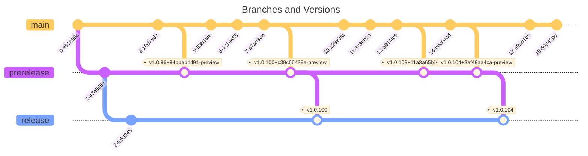

# Release Process and Cadence

## .NET Tool (NuGet Gallery) release model

.NET Tools ship via [NuGet Gallery](https://gallery.nuget.org).
Each tool can have two versions available for customers to install: 
1. A "release" version that customers get by default when installing the tool.
1. A "prerelease" version that customers can opt-into.

## Workflow for prereleases
1. Feature work and most bug fixes are made in `main`.
1. As we draw close to publishing a prerelease, use a pull request from `main` to `prerelease`.
1. Targeted fixes that apply to an upcoming prerelease during stabilization should be made directly to the `prerelease` branch via pull request.
   * Each pull request targeting `prerelease` must be approved by a member of the [xcsync QB Approvers](https://dev.azure.com/devdiv/DevDiv/_settings/teams?subjectDescriptor=vssgp.Uy0xLTktMTU1MTM3NDI0NS0yNDI4ODg1NzcxLTE2NTQ2NjkxMzItMjk2ODk0OTYzNS00MTM1MDg1NTUwLTEtMjczMTg4OTY5LTQ3NzYxMjg2OS0yMjc1ODE1NzQwLTE3NDg2NTY0MDA) team.
1. The `prerelease` branch builds a real-signed NuPkg in [its CI builds](https://dev.azure.com/dnceng/internal/_build?definitionId=1399&branchFilter=261083) by default. Any of these builds may be tagged `auto-release` to begin the process of publishing to the NuGet Gallery.
1. The [xcsync release pipeline](https://dev.azure.com/dnceng/internal/_build?definitionId=1399) will be triggered by the added `auto-release` tag.
1. Members of the AzDO [xcsync Release Approvers](https://dev.azure.com/devdiv/DevDiv/_settings/teams?subjectDescriptor=vssgp.Uy0xLTktMTU1MTM3NDI0NS0yNDI4ODg1NzcxLTE2NTQ2NjkxMzItMjk2ODk0OTYzNS00MTM1MDg1NTUwLTEtMTIxODc3NDExMC0zMjIxODMwLTIyNTQyOTc4NTYtMzg0MDUwNTY5) Team will be notified by email to review and approve the request to publish to the NuGet Gallery.
1. Upon approval, the release pipeline will proceed to:
   1. Marks the real-signed build to be retained for 2 years.
   1. Publish the NuPkgs to the NuGet Gallery.

## Workflow for (stable) releases

Stable releases are just like the prerelease workflow above, except that the initial pull request is from `prerelease` to `release`.
All other references to the `prerelease` branch should be replaced by `release`.
[CI builds for the `release` branch](https://dev.azure.com/devdiv/DevDiv/_build?definitionId=17523&branchFilter=585079).

## Other notes

Merges from `release` or `prerelease` back to `main` are allowed and encouraged to ensure all servicing fixes are also in `main`.

## FAQ

* **Why don't we have versioned release branches?**
  
  This repository follows a slightly modified flow. There are only three versions of the product ever in flight. The `release` branch contains the latest stable version of the product. The `prerelease` branch is the vNext version of the product, and `main` contains the active development. This is explained in more deatil in the [Release Cadence](#Release Cadence) section

* **What happens to version.json and the versions represented there?**

  To simplify branch flow, it will always indicate 'stable' versions, but only the `release` branch is considered a 'public release'. Built NuPkgs will be stamped with the NuGet 'prerelease' tag based on which branch it was built from. All branches are considered prerelease except for the `release` branch.

## Security sensitive resources

Resource | Privileges | Protections
--|--|--
[NuGet Gallery](https://dev.azure.com/devdiv/DevDiv/_library?itemType=VariableGroups&view=VariableGroupView&variableGroupId=481&path=NuGetGallery) variable group | Contains the PAT necessary to publish Microsoft official extensions to the NuGet Gallery. | Security prevents new pipelines consuming it. Approval required for each pipeline run by a member of the "xcsync Release Approvers" team. Only runs from particular branches can consume it.
[xcsync Release Approvers](https://dev.azure.com/devdiv/DevDiv/_settings/teams?subjectDescriptor=vssgp.Uy0xLTktMTU1MTM3NDI0NS0yNDI4ODg1NzcxLTE2NTQ2NjkxMzItMjk2ODk0OTYzNS00MTM1MDg1NTUwLTEtMTIxODc3NDExMC0zMjIxODMwLTIyNTQyOTc4NTYtMzg0MDUwNTY5) Team | Members may approve pipeline runs that use the `NuGetGallery` variable group. | Only admins of the group can add members.
[`azure-pipelines\release.yml`](https://dev.azure.com/devdiv/DevDiv/_git/vs-green?path=/azure-pipelines/release.yml) | Defines the release pipeline that handles the NuGet Gallery PAT and publishes releases | Branch protection filter on that path requires a member of the [xcsync](https://dev.azure.com/devdiv/DevDiv/_settings/teams?subjectDescriptor=vssgp.Uy0xLTktMTU1MTM3NDI0NS0yNDI4ODg1NzcxLTE2NTQ2NjkxMzItMjk2ODk0OTYzNS00MTM1MDg1NTUwLTEtMzk1MDI0MDM4Ny0xMjM2NDEzNzYyLTMwMjc0NTY4MjEtMzI5MDYxMzI4MA) Team to approve.
[xcsync release](https://dev.azure.com/devdiv/DevDiv/_build?definitionId=18323) pipeline | Granted access to the "NuGetGallery" variable group. | Pipeline permissions locked down to just VSBranchChamps and "xcsync Release Approvers" teams.  See also protections on `azure-pipelines\release.yml`, which encodes the behavior of this pipeline.
[xcsync](https://dev.azure.com/devdiv/DevDiv/_build?definitionId=17523) pipeline | Builds the xcsync .NET Tool that may eventually ship and signs it | Only standard pipeline protections.

## Release Cadence
The goal is to eventually get to the point where we could release daily but we will start with weekly updates.

* All commits into main branch by Monday 4pm PST will get merged from main -> prerelease.
* The team and CSI will test the prerelease builds and signoff is due by Tuesday 4pm (24 hours).
* If there is sign off, the build will get uploaded Wed ~9am. Builds from the prerelease branch will be marked as prerelease builds in the gallery
* If an external user finds a blocking bug in prerelease, they can revert back to the release build
* At measured times, we can merge prerelease -> release and upload a release build of the extension

